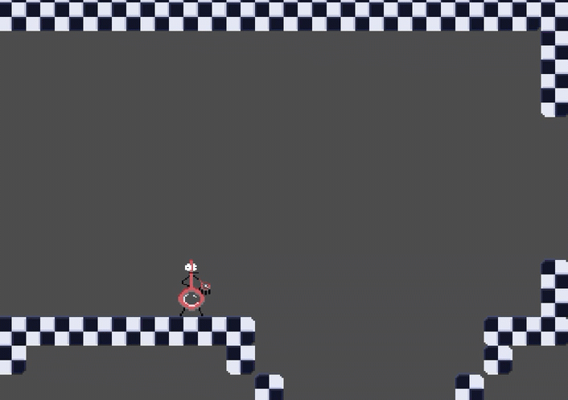

# Global Game Jam - January 24-26, 2025

[Global Game Jam](https://www.meetup.com/nashgamedev/events/305578049/?eventOrigin=group_upcoming_events) with [Nashville Game Developers](https://nashgame.dev/).

## Bubble Boy's Bodacious Bubbleventure

Judah and Gage created a 2d platformer in Godot using Aseprite for game assets.

[Play Bubble Boy's Bodacious Bubbleventure](https://home-gamejam.github.io/global-gamejam-202501/bubbleboy/)

> Requires keyboard

[Global Game Jam - Bubble Boy's Bodacious Bubbleventure](https://globalgamejam.org/games/2025/bubble-boys-bodacious-bubbleventure-1)

## Bubble Run

3D platformer made in Godot and Blender

[Play Bubble Run](https://home-gamejam.github.io/global-gamejam-202501/bubblerun/)
